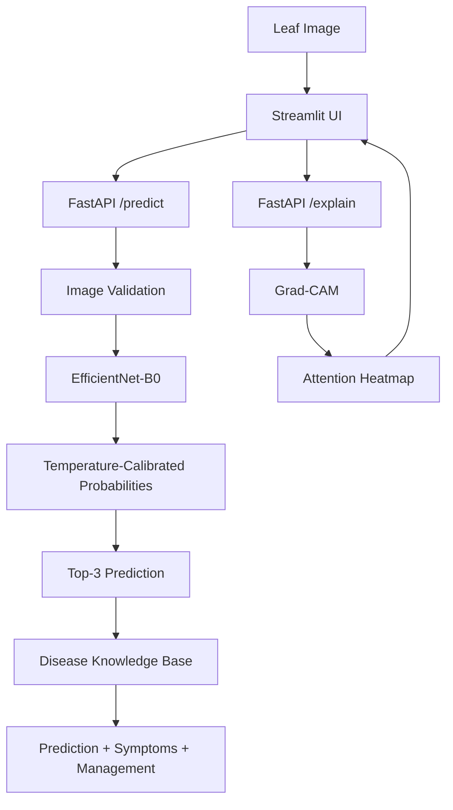

# Plant Disease Detection System — V2

AI-assisted plant disease screening system for Potato and Tomato leaves, built with a reproducible machine-learning pipeline, EfficientNet-B0, FastAPI, Streamlit, Grad-CAM explainability, confidence calibration, and a structured disease knowledge base.

> **Important:** This system is a screening and decision-support tool. It is not a substitute for professional agricultural diagnosis.

## Highlights

- Six-class plant disease classification
- Group-aware train/validation/test evaluation
- EfficientNet-B0 transfer-learning model
- **99.90% held-out test accuracy**
- **99.92% held-out test macro F1**
- Held-out test set of **1,001 images**
- No detected cross-split group overlap
- Temperature-calibrated probabilities
- Top-3 predictions
- Grad-CAM visual explanations
- Structured disease knowledge base
- FastAPI inference backend
- Streamlit user interface
- Automated API regression tests
- GPU inference support with CUDA
- GitHub Actions CI
- Docker deployment configuration
- Model benchmarking and experiment reports

---

## Supported Classes

| Crop | Disease / Status |
|---|---|
| Potato | Early Blight |
| Potato | Late Blight |
| Potato | Healthy |
| Tomato | Early Blight |
| Tomato | Late Blight |
| Tomato | Healthy |

---

## System Architecture



---

## Dataset and Evaluation

The project contains **6,652 validated images**.

| Split | Images |
|---|---:|
| Train | 4,655 |
| Validation | 996 |
| Test | 1,001 |

The final benchmark uses a group-aware split to reduce leakage from duplicated or closely related source images.

Validated cross-split group overlap:

```text
Train <-> Validation: 0
Train <-> Test:       0
Validation <-> Test:  0
```

All 6,652 images passed the dataset validation process.

---

## Primary Model

The primary model is a pretrained **EfficientNet-B0** fine-tuned for six-class plant disease classification.

### Held-out grouped test performance

| Metric | Score |
|---|---:|
| Accuracy | **99.90%** |
| Macro Precision | **99.89%** |
| Macro Recall | **99.94%** |
| Macro F1 | **99.92%** |
| Weighted F1 | **99.90%** |

The held-out test set contains 1,001 images.

### Per-class performance

| Class | Precision | Recall | F1 | Support |
|---|---:|---:|---:|---:|
| Potato Early Blight | 1.0000 | 1.0000 | 1.0000 | 150 |
| Potato Late Blight | 1.0000 | 1.0000 | 1.0000 | 150 |
| Potato Healthy | 1.0000 | 1.0000 | 1.0000 | 24 |
| Tomato Early Blight | 0.9934 | 1.0000 | 0.9967 | 150 |
| Tomato Late Blight | 1.0000 | 0.9965 | 0.9983 | 287 |
| Tomato Healthy | 1.0000 | 1.0000 | 1.0000 | 240 |

There was one held-out test error:

```text
Actual:      Tomato Late Blight
Predicted:   Tomato Early Blight
Confidence:  0.9253
```

These results describe performance on the evaluated grouped dataset and do not guarantee equivalent real-world diagnostic accuracy.

---

## Model Benchmark

EfficientNet-B0 was compared with a robust ResNet18 reference model.

| Model | Parameters | Batched Latency / Image | Throughput | Checkpoint |
|---|---:|---:|---:|---:|
| ResNet18 Robust | 11,179,590 | 0.987 ms | 1013.20 img/s | 42.72 MB |
| EfficientNet-B0 | 4,015,234 | 1.371 ms | 729.40 img/s | 15.61 MB |

The EfficientNet-B0 checkpoint is substantially smaller while providing stronger grouped held-out classification performance in this project.

Additional benchmark artifacts are available under:

```text
reports/results/
```

---

## Confidence Calibration

Temperature scaling was evaluated on the validation set.

| Metric | Before | After |
|---|---:|---:|
| Accuracy | 0.9970 | 0.9970 |
| NLL | 0.0211 | 0.0211 |
| ECE | 0.0038 | 0.0037 |
| Mean Confidence | 0.9944 | 0.9946 |

Learned temperature:

```text
0.984268
```

The calibration analysis indicates that the model probabilities were already reasonably calibrated on the validation distribution.

Confidence should still be interpreted cautiously, particularly for images outside the training distribution.

The current system deliberately does not use a hard-coded confidence threshold as an automatic diagnosis or review rule.

---

## Explainability

The application provides **Grad-CAM** explanations for predictions.

The Grad-CAM implementation targets the final convolutional feature representation of EfficientNet-B0 and generates an attention heatmap over the uploaded image.

Relevant artifacts include:

```text
src/explainability/gradcam.py
src/explainability/generate_gradcam.py
reports/figures/efficientnet_b0_gradcam_error.png
```

The explanation endpoint is:

```text
POST /explain
```

Grad-CAM provides an interpretable visual indication of regions contributing to a prediction. It should not be interpreted as proof that the highlighted region represents the biological cause of a disease.

---

## Knowledge Base

The system includes a structured JSON knowledge base for all six supported classes.

File:

```text
knowledge_base/diseases.json
```

The knowledge base contains:

- Crop
- Disease / status
- Severity
- Symptoms
- General management
- Advisory information

The knowledge base is informational and is not a substitute for professional agronomic advice.

---

## API

FastAPI provides the inference backend.

### Health check

```text
GET /health
```

### Model information

```text
GET /model-info
```

### Prediction

```text
POST /predict
```

Supported image types:

- JPEG
- PNG
- WEBP
- BMP

Prediction responses include:

- predicted class
- confidence
- second-best confidence
- confidence margin
- top-3 predictions
- disease knowledge-base information
- model metadata

### Explainability

```text
POST /explain
```

Returns a Grad-CAM PNG image with prediction metadata in response headers.

---

## Streamlit Interface

The frontend provides:

1. Image upload
2. Disease prediction
3. Confidence display
4. Top-3 predictions
5. Disease information
6. Grad-CAM visualization

Local frontend:

```text
http://localhost:8501
```

Local API:

```text
http://127.0.0.1:8000
```

---

## Installation

### Common environment

```powershell
python -m venv .venv
.\.venv\Scripts\Activate.ps1
python -m pip install -r requirements.txt
```

### NVIDIA GPU environment

For the configured CUDA 12.8 environment:

```powershell
python -m pip install -r requirements-gpu.txt
```

Verify GPU availability:

```powershell
python -c "import torch; print(torch.cuda.is_available()); print(torch.cuda.get_device_name(0) if torch.cuda.is_available() else 'CPU')"
```

### CPU / CI environment

```powershell
python -m pip install -r requirements-ci.txt
```

---

## Run the API

```powershell
python -m uvicorn app.api:app --host 0.0.0.0 --port 8000
```

API documentation:

```text
http://127.0.0.1:8000/docs
```

---

## Run the Streamlit Application

Start the API first, then run:

```powershell
streamlit run app/streamlit_app.py
```

Open:

```text
http://localhost:8501
```

---

## Testing

Run the complete test suite:

```powershell
python -m pytest tests -v
```

The current API test suite covers:

- health endpoint
- model information
- valid prediction
- unsupported file type rejection
- invalid image rejection
- Grad-CAM response

The tests intentionally use a generated test image instead of the private training dataset, allowing the suite to run inside GitHub Actions.

Check dependency consistency:

```powershell
python -m pip check
```

Current CI result:

```text
6 tests passed
```

---

## Continuous Integration

GitHub Actions runs on pushes and pull requests targeting `main`.

Workflow:

```text
Checkout repository
        ↓
Python 3.11
        ↓
Install CPU dependencies
        ↓
pip check
        ↓
pytest
```

Workflow file:

```text
.github/workflows/ci.yml
```

The CI workflow has been validated successfully on GitHub Actions.

---

## Docker

A CPU-oriented Docker configuration is included.

Build:

```powershell
docker build -t plant-disease-detection-v2 .
```

Run:

```powershell
docker run -p 8000:8000 plant-disease-detection-v2
```

The container exposes port:

```text
8000
```

Docker configuration is included in the repository, but Docker image construction has not been locally validated on the current Windows development machine because Docker Desktop is not installed.

---

## Repository Structure

```text
plant disease detection/
│
├── app/
│   ├── api.py
│   ├── streamlit_app.py
│   ├── test_api.py
│   ├── test_explain_api.py
│   └── test_predict_explain_sequence.py
│
├── knowledge_base/
│   └── diseases.json
│
├── models/
│   └── checkpoints/
│       └── efficientnet_b0_best.pth
│
├── reports/
│   ├── figures/
│   └── results/
│
├── src/
│   ├── explainability/
│   ├── inference/
│   └── utils/
│
├── tests/
│   └── test_api.py
│
├── training/
│   ├── train_efficientnet_b0.py
│   ├── train_resnet18.py
│   ├── run_resnet18_robust.py
│   └── gpu_smoke_test.py
│
├── .github/
│   └── workflows/
│       └── ci.yml
│
├── .dockerignore
├── .gitignore
├── Dockerfile
├── MODEL_CARD.md
├── README.md
├── requirements.txt
├── requirements-ci.txt
└── requirements-gpu.txt
```

---

## Limitations

- Evaluation is limited to six Potato and Tomato classes.
- Strong benchmark performance does not guarantee performance on field images.
- Lighting, camera differences, background variation, image quality, and unseen conditions may affect predictions.
- The system does not currently provide a dedicated out-of-distribution detector.
- Confidence values are calibrated on the validation distribution and should not be treated as probabilities of diagnostic correctness.
- The knowledge base contains general guidance rather than expert agronomic advice.
- The benchmark dataset may not represent the full diversity of real agricultural environments.
- External field validation has not yet been performed in this repository.

---

## Future Work

Potential improvements include:

- Out-of-distribution detection
- Image-quality assessment
- Larger field-image evaluation
- Additional crops and diseases
- Model quantization
- Inference optimization
- Production monitoring
- Cloud deployment
- Larger and more diverse datasets
- Human-in-the-loop review workflows

---

## Reproducibility

The project records:

- dataset validation
- group-aware splits
- training histories
- confusion matrices
- misclassification analysis
- confidence calibration
- model efficiency benchmarks
- single-image latency benchmarks

Experiment artifacts are stored under:

```text
reports/results/
```

Important model artifacts include:

```text
models/checkpoints/efficientnet_b0_best.pth
reports/results/efficientnet_b0_calibration.json
reports/results/efficientnet_b0_test_results.json
reports/results/model_benchmark.json
```

---

## Model Documentation

See:

```text
MODEL_CARD.md
```

for detailed information about:

- intended use
- evaluation
- calibration
- explainability
- limitations
- risk considerations
- reproducibility

---

## Project Status

**Plant Disease Detection System V2 — Core implementation complete.**

The current version includes:

- ✅ EfficientNet-B0 primary model
- ✅ Group-aware evaluation
- ✅ Confidence calibration
- ✅ Grad-CAM explainability
- ✅ Disease knowledge base
- ✅ FastAPI backend
- ✅ Streamlit frontend
- ✅ Automated tests
- ✅ GitHub Actions CI
- ✅ GPU dependency configuration
- ✅ Docker deployment configuration

Public cloud deployment and external field validation remain future deployment/validation steps.

---

## License

Add the project's chosen open-source license before public distribution.
